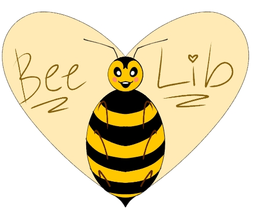
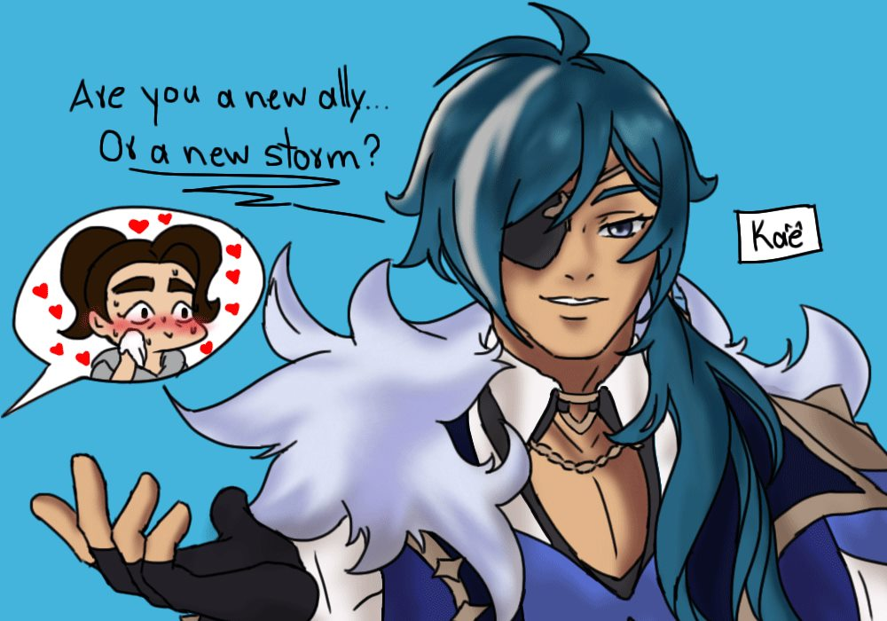
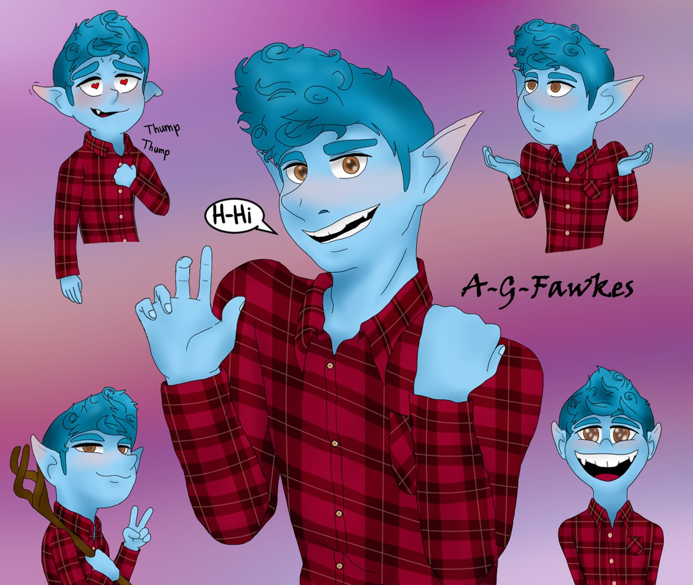
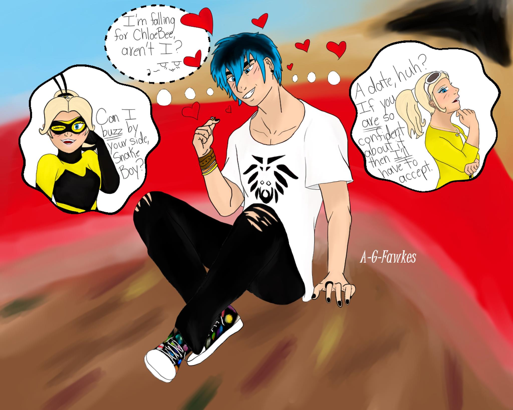

<!DOCTYPE html>
<html>
<head>
  <title>Page Title</title>
  
</head>
<body>
  
<h1>BeeLib's Hive</h1>

  

  

    Welcome to my hive, here you'll be able to find my doodles, sketches and art in general. Hope you enjoy!
     
    My name is Libertad and I'm currently working on getting my Bachelor's Degree at The College of Westchester. I'm from Guatemala but have been living in the US for almost 10 years now so I can communicate in both Spanish and English with no problem.
     
    I look forward to finishing college and continue to better my skills to work on commissions on a regular basis and eventually get a position on an animation or videogame company.
  

    
    
    
  <footer>
    <a href="https://www.instagram.com/_america_galvez_/" target="_blank">Instagram</a> |
    <a href="https://x.com/_Libertad_Gal" target="_blank">Twitter/X</a> |
    <a href="https://www.youtube.com/channel/UCXuKYkdQLArPec0ikXuEIUQ" target="_blank">YouTube</a>
      
    &copy; All Rights Reserved 2025
  </footer>
</body>
</html>

